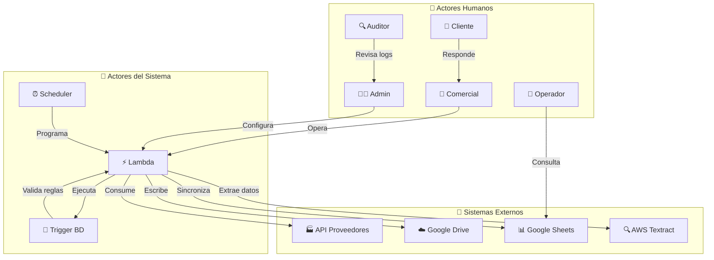

  

  
  

---

### 👨‍💻 Sobre mí

Apasionado por la ciencia de datos, MLOps y automatización de procesos.  
Actualmente curso una **Maestría en Ingeniería y Ciencia de Datos** en la Universidad de Guadalajara y trabajo en una empresa de logística de hidrocarburos desarrollando soluciones serverless y arquitecturas modernas.

- 🚀 Desarrollador de soluciones en la nube con **AWS (Lambda, Step Functions, API Gateway, Textract, etc.)**
- 🏗️ Automatización de infraestructura con **Terraform** y despliegue CI/CD usando **GitHub Actions**.
- 🧠 Enfocado en la eficiencia de datos usando **Polars**, **PostgreSQL** y microservicios en **FastAPI / Flask**.
- 📫 Contacto: [sergio.anayads@gmail.com](mailto:sergio.anayads@gmail.com) | [LinkedIn](https://www.linkedin.com/in/sergio-anaya-sanchez/)

---

### ⚒️ Lenguajes y herramientas

---

### 🧠 Experiencia técnica destacada

- 🧱 Construcción de microservicios serverless en AWS con autenticación personalizada vía Lambda Authorizers.
- 📊 ETLs de alto rendimiento con **Polars** y despliegue automatizado con **Terraform**.
- 🔄 Automatización de pipelines con **GitHub Actions** para CI/CD.
- 🔌 Integraciones externas con APIs de terceros como **Samsara**, **Google Drive**, **Google Sheets**, **PEMEX** y **AWS Textract**.
- 🗃️ Administración de bases de datos relacionales en **Aurora PostgreSQL** y **MySQL**.

---

### 🧩 Arquitectura de un sistema desarrollado

Este sistema está orientado a la automatización de procesos operativos y de auditoría en una comercializadora, integrando múltiples actores y servicios cloud:

### 🚀 Proyectos Destacados

#### ⚙️ Red Energy API  
Plataforma serverless basada en **AWS SAM** + **Step Functions**, utilizada para la orquestación de microservicios y autenticación mediante tokens personalizados.

- ✔️ Uso de **API Gateway**, **Aurora PostgreSQL**, y **Lambda Authorizer**.  
- 🔐 Seguridad y validación de endpoints con **Lambdas dedicadas**.

---

#### 📈 ETLs con Polars y Terraform  
Automatización de pipelines de datos modernos con **Polars**, desplegados en la nube con **Lambda** y **Terraform**.

- ⚡ Procesamiento rápido y eficiente de grandes volúmenes de datos.  
- 🔄 Despliegue automatizado usando **GitHub Actions** para CI/CD.

---

#### 🚛 Sistema de monitoreo logístico  
Integración de APIs como **Samsara** para trazabilidad y monitoreo en tiempo real de activos y vehículos.

- 🌐 Integración con **Step Functions** y almacenamiento en **Aurora PostgreSQL**.  
- 📡 Visualización de rutas y actividad por cliente o unidad.
---

### 🔥 Mis estadísticas

  
    
  

---

### 📬 Contacto

  
  
  

